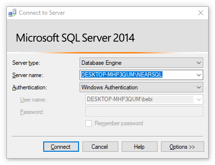

# BookstoreManagement

[](https://github.com/NearHuscarl/BookstoreManagement/blob/master/LICENSE.md)
[](https://github.com/NearHuscarl/BookstoreManagement/tree/master)


## Getting Started

Setup SQL Server database by changing your server name in the following places. In the example the server name is `DESKTOP-MHP3QUM\NEARSQL`



### [App.config](src/BookstoreManagement.GUI/App.config)

```diff
<?xml version="1.0" encoding="utf-8" ?>
<configuration>
    <startup>
        <supportedRuntime version="v4.0" sku=".NETFramework,Version=v4.6.1" />
    </startup>
	<appSettings>
+		<add key="ConnectionStr" value="Data Source=DESKTOP-MHP3QUM\NEARSQL;Initial Catalog=BookstoreManagement;Integrated Security=True"/>
	</appSettings>
</configuration>
```

### [CreateDb.cmd](src/CreateDb.cmd)

```
SQLCMD -S DESKTOP-MHP3QUM\NEARSQL -E -i CreateDB.sql
```